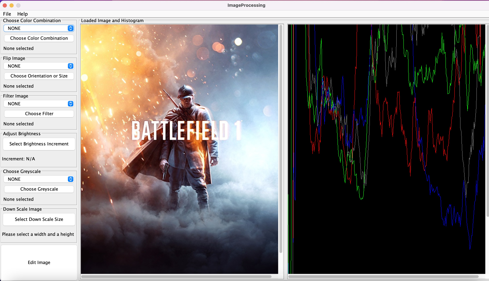

# Program usage instructions:

## RUNNING THE PROGRAM AND VALID INPUT:
- To run the program, go to the ImageProgram class and run the main method.
- No command line arguments are required to run the program, although the user can input a file name as a command line argument and the program will run the commands in that file.
- If no command line arguments are provided, the program will prompt the user for input.

**ALL INPUTS ARE CASE SENSITIVE**

    Example: 'Load' is not the same as load. If you give an image the name 'example' and another image the
    name 'Example', the program recognize the two images as different.

Valid inputs:
(1) '**load**' (filepath) (filename)
- This command loads an image from the local machine.
- (filepath) is the path to the file.
- (filename) is the name that you want to use to refer to the image in the program.

    Example: 'load /home/user/example.ppm ex'
    -Loads the image example.ppm from the local machine, which can be referred to as 'ex' in the program.

(2) '**save**' (filepath) (filename)
- This command saves the image to the local machine.
- (filepath) is the path to the new file that is going to be created.
- (filename) is the name of the file that you want to save.

    Example: 'save /home/user/newExample.ppm ex'
    -Saves the image ex to the local machine, which can is called newExample.ppm on the local machine.

(3) '**adjust-brightness**' (increment) (filename) (new filename)
- This command adjusts the brightness of the image.
- (increment) is the amount of brightness you want to adjust the image by. Inputted as a negative number if you want to dim the image, and as a positive number if you want to brighten the image.
- (filename) is the name of the image that you want to adjust the brightness of.
- (new filename) is the name of the new image that was brightened or dimmed.

    Example: 'adjust-brightness -50 ex dimmedEx'
    -Adjusts the brightness of the image ex by -50, and names the image as dimmedEx.

(4) '**vertical-flip**' (filename) (new filename)
- This command flips the image vertically.
- (filename) is the name of the image that you want to flip vertically.
- (new filename) is the name of the new image that was flipped vertically.

    Example: 'vertical-flip ex vFlippedEx'
    -Flips the image ex vertically, and names the image as vFlippedEx.

(5) '**horizontal-flip**' (filename) (new filename)
- This command flips the image horizontally.
- (filename) is the name of the image that you want to flip horizontally.
- (new filename) is the name of the new image that was flipped horizontally.

    Example: 'horizontal-flip ex hFlippedEx'
    -Flips the image ex horizontally, and names the image as hFlippedEx.

(6) '**greyscale-red**' (filename) (new filename)
- This command creates a red greyscale image.
- (filename) is the name of the image that you want to create a red greyscale image of.
- (new filename) is the name of the new image that was created as a red greyscale image.

    Example: 'greyscale-red ex redGreyscaleEx'
    -Creates a red greyscale image of the image ex, and names the image as redGreyscaleEx.

(7) '**greyscale-green**' (filename) (new filename)
- This command creates a green greyscale image.
- (filename) is the name of the image that you want to create a green greyscale image of.
- (new filename) is the name of the new image that was created as a green greyscale image.

    Example: 'greyscale-green ex greenGreyscaleEx'
    -Creates a green greyscale image of the image ex, and names the image as greenGreyscaleEx.

(8) '**greyscale-blue**' (filename) (new filename)
- This command creates a blue greyscale image.
- (filename) is the name of the image that you want to create a blue greyscale image of.
- (new filename) is the name of the new image that was created as a blue greyscale image.

    Example: 'greyscale-blue ex blueGreyscaleEx'
    -Creates a blue greyscale image of the image ex, and names the image as blueGreyscaleEx.

(9) '**luma**' (filename) (new filename)
- This command creates a luma greyscale image.
- (filename) is the name of the image that you want to create a luma greyscale image of.
- (new filename) is the name of the new image that was created as a luma greyscale image.

    Example: 'luma ex lumaGreyscaleEx'
    -Creates a luma greyscale image of the image ex, and names the image as lumaGreyscaleEx.

(10) '**intensity**' (filename) (new filename)
- This command creates an intensity greyscale image.
- (filename) is the name of the image that you want to create an intensity greyscale image of.
- (new filename) is the name of the new image that was created as an intensity greyscale image.

    Example: 'intensity ex intensityGreyscaleEx'
    -Creates an intensity greyscale image of the image ex, and names the image as intensityGreyscaleEx.

(11) '**value**' (filename) (new filename)
- This command creates a value greyscale image.
- (filename) is the name of the image that you want to create a value greyscale image of.
- (new filename) is the name of the new image that was created as a value greyscale image.

    Example: 'value ex valueGreyscaleEx'
    -Creates a value greyscale image of the image ex, and names the image as valueGreyscaleEx.

(12) '**sharpen**' (filename) (new filename)
- This command creates a sharpened image, adding more contrast.
- (filename) is the name of the image that you want to create a value sharpened image of.
- (new filename) is the name of the new image that was created as a value sharpened image.

    Example: 'sharpen ex sharpenedEx'
    -Creates a sharpened image of the image ex, and names the image as sharpenedEx.

(13) '**blur**' (filename) (new filename)
- This command creates a blurred image.
- (filename) is the name of the image that you want to make blurred.
- (new filename) is the name of the new image that was blurred.

    Example: 'blur ex blurredEx'
    -Creates a blurred image of the image ex, and names the image as blurredEx.

(14) '**sepia**' (filename) (new filename)
- This command creates a sepia image, giving it a reddish brown tone.
- (filename) is the name of the image that you want to create a sepia image of.
- (new filename) is the name of the new image that was created as a sepia image.

    Example: 'sepia ex sepiaEx'
    -Creates a sepia image of the image ex, and names the image as sepiaEx.

(15) '**greyscale**' (filename) (new filename)
- This command creates a greyscale image.
- (filename) is the name of the image that you want to create a greyscale image of.
- (new filename) is the name of the new image that was created as a greyscale image.

    Example: 'greyscale ex greyscaleEx'
    -Creates a greyscale image of the image ex, and names the image as greyscaleEx.

(15) '**downscale**' (filename) (new filename) (width) (height)
- This command creates a greyscale image.
- (filename) is the name of the image that you want to create a greyscale image of.
- (new filename) is the name of the new image that was created as a greyscale image.
- (width) is the width of the new image.
- (height) is the height of the new image.

    Example: 'greyscale ex greyscaleEx'
    -Creates a greyscale image of the image ex, and names the image as greyscaleEx.

(16) '**q**' to quit
- This command quits the program.
- You cannot quit in the middle of a command, and can only quit before or after executing a command.

**INPUTS CAN BE SEPERATED BY SPACES OR BY NEW LINES**

    Example: (1) 'load /home/user/example.ppm ex'
             (2) 'load'
                 '/home/user/example.ppm'
                 'ex'
    (1) and (2) are both valid inputs and are allowed.

## SCRIPT:

**Vertically flip an image and save it:**

    Example: load res/colors.ppm colors
             vertical-flip colors vFlippedColors
             save res/colors-vertical.ppm vFlippedColors

Refer to the full script found in the Script.txt file located in the res directory.

**RUNNING THE SCRIPT:**
- To automatically run the script file, input the file path of the script file as a command line argument. You must type "-file" as the first argument.
- **"Script.txt"** is the file name of the script file.

    Example: "-file res/Script.txt" as a command line argument

## JAR INSTRUCTIONS:

**The jar file is located in the res directory.**
- Navigate to the res directory in your terminal to run the jar. 
- Use the command **"java -jar ImageProcessing.jar -file Script.txt"**
    - This command will run the jar file and run the script file.
    - The script file must be located in the same directory as the jar file.
    - The lake.jpg file also be located in the same directory as the jar file.
- To run the program using text commands enter: -jar ImageProcessing.jar -text
- To run the program using the GUI: -jar ImageProcessing.jar

## GUI:
**Load an image through the Load menu in the top left corner.**
- To preform an Action:
  - (1) The user should choose through the dropdown menus the action they wish to preform
  - (2) Press the choose button so save in the program which action they will be preforming.
  - (3) When the user has chosen all the edits, press the edit button on the bottom left to preform the actions
- To save an image:
  - Navigate to the top left file menu
  - Select 'Save'
  - Navigate to desired save path and enter desired file name 
- For Help:
  - Navigate to the Help button at the top left
- Example of the GUI with an image loaded:
- 
